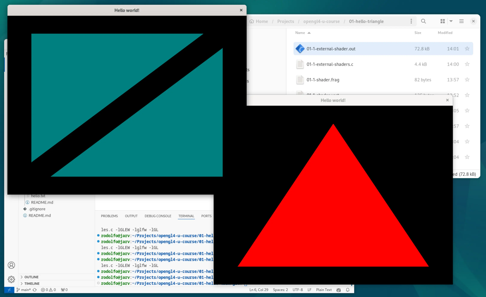

# First Triangle

This section builds on top of the boilerplate code in the [setup section](../00-glew-glfw-setup/README.md). There are a few new functions to handle the creation of two new shader programs (vertex and fragment shaders). The new code takes care of compiling and linking those shaders. The final program just draws a red triangle in the screen.

Use the same command as in the previous section to compile the source code here:
```
gcc -o 01-first-traingle.out 01-first-triangle.c -lGLEW -lglfw -lGL
```

Although the instructor mentioned that he will explain how to edit the program to have the shader source code in a separate file, I attempted my own version of loading the shader source code from a separate file.

Therefore, these are the different source codes I created in this section:
- `01-first-triangle.c`: Original basic red triangle.
- `01-1-external-shader.c`: Attempt to load a shader program in a different file.
- `01-2-two-triangles.c`: Exploring the concepts of vertices to draw more than one triangle.

<div align="center">
  
</div>

All the versions are compiled with the same command, just replace the proper filenames.
```
gcc -o <output.out> <source.c> -lGLEW -lglfw -lGL
```

## Debugging
At some point, the first version of the progam would crash. Using a debugger like the GNU debugger was helpful for this. Without needed to set breakpoints, running the program until it crashed and checking the backtrace of all stack frames was enough to pinpoint the issue.

```
gcc -o 01-first-traingle.out 01-first-triangle.c -lGLEW -lglfw -lGL -g
gdb ./01-first-triangle.out
```

```
(gdb) run
(gdb) bt
```

## Optimizing Loop
There are two versions, `01-3-optimized-loop-vsync.c` and `01-4-optimized-loop-events.c`, that try to reduce the number of loops that happen in a second. The first program uses V-Sync to match the screen refresh rate. The second waits for user input instead of pulling. Since I am generating static images for now, the second option may be best.